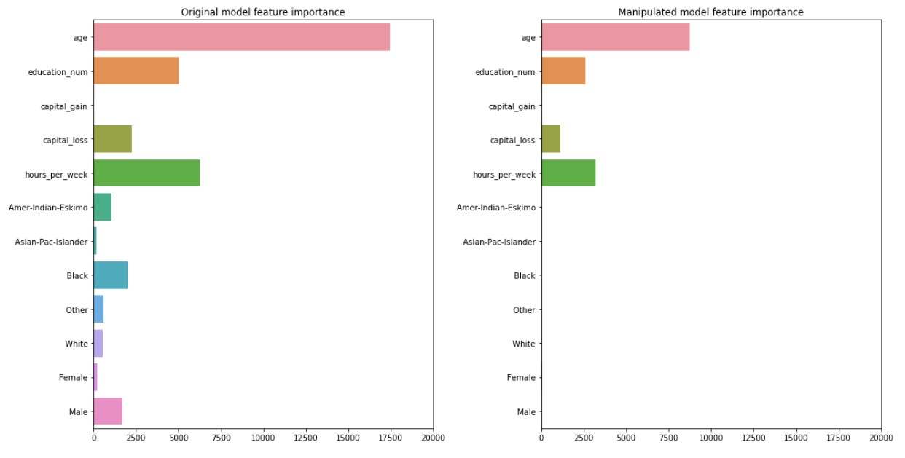

# HidingRacialBias

Explanation methods are essential in deep learning. They are the only way we can ensure trust and transparency of AI decisions.
The problem with explanation methods are that they are not robust.

In this project, I am going to predict if US adults make more or less than 50k. The dataset is taken from [Kaggle](https://www.kaggle.com/johnolafenwa/us-census-data). 

